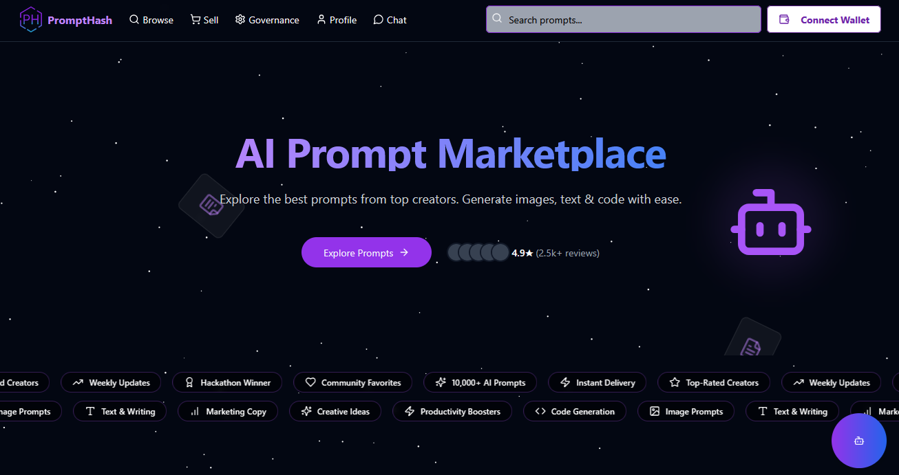

## AI Prompt Marketplace



## PromptHash

PromptHash is a dynamic, AI-powered marketplace connecting prompt creators with users seeking inspiration, productivity, and cutting-edge solutions. Leveraging the high-throughput, low-latency Hedera Hashgraph network for core marketplace operations and privacy-focused tooling for AI integration, our platform enables users to explore, create, buy, and sell high-quality AI prompts across various categories.

---

## 🚀 Vision

Our vision is to become the go-to resource where creators and users converge—leveraging advanced AI models, enterprise-grade Hedera Hashgraph infrastructure, and intuitive design—to spark transformative ideas across industries.

---

## 🔑 Key Features

* **🔍 Browse & Discover**: Explore curated collections of AI prompts from top creators.
* **💰 Buy & Sell Prompts**: Monetize your expertise or find the perfect prompt, with all transactions settled via HBAR on Hedera.
* **🤖 Advanced AI Integration**: Powered by cutting-edge AI models (e.g., DeepSeek R1, Llama 3.2 Vision) through our privacy-preserving AI gateway.
* **🔗 Hedera Smart Contracts**: On-chain prompt registry and payment escrow flows executed on Hedera using Solidity-compatible smart contracts.
* **🔒 Blockchain Security**: Built on Hedera’s asynchronous Byzantine Fault Tolerance (aBFT) infrastructure for enterprise-grade safety.
* **💬 Conversational AI**: Maintain context-aware chat sessions to refine or generate prompts in real time.
* **🏛️ Governance**: Community-driven platform development and on-chain governance proposals via Hedera governance service.
* **✨ Prompt Engineering Tools**: Interactive utilities to analyze, optimize, and refactor AI prompts.
* **👨‍💻 Creator Profiles**: Dedicated spaces for top prompt creators, with on-chain reputation badges.
* **🖼️ Multi-Format Support**: Generate images, text, and code with ease.
* **📚 Comprehensive Documentation**: Detailed API documentation available via Swagger UI and ReDoc.

---

## ⚙️ Features & Overview

### Discover & Explore

Browse a curated collection of AI prompts across categories like Coding, Marketing, Creative Writing, and Business.

### Sell & Share

List and monetize your top AI prompts with instant HBAR settlements. Smart contract escrow ensures prompt delivery before funds release.

### Interactive Chat

Use our AI chatbox to get prompt recommendations and marketplace insights, with seamless on-chain logging of session metadata.

### Responsive UI

Built with Next.js, React, and Tailwind CSS for a seamless, mobile-first experience.

### API Integration

Easy integration with your applications via our RESTful and GraphQL API endpoints, complete with Hedera transaction whitelisting.

---

## 🛠️ Categories

* **📸 Image Prompts:** For visual content generation.
* **📝 Text & Writing:** Creative writing, copywriting, and content creation.
* **📊 Marketing Copy:** Advertising, emails, and conversion-focused content.
* **💡 Creative Ideas:** Brainstorming and concept development.
* **🚀 Productivity Boosters:** Efficiency and workflow optimization.
* **💻 Code Generation:** Programming assistance and development.

---

## 🏗️ Tech Stack

* **Frontend:** Next.js, React, Tailwind CSS
* **Backend:** FastAPI for AI services; Node.js/Express for blockchain gateway
* **AI Integration:** Private inference through Secret Network AI API
* **Blockchain Integration:** Hedera Hashgraph via Hedera JavaScript SDK / hethers.js
* **Smart Contracts:** Solidity (v0.8.17) deployed on Hedera Testnet/Mainnet
* **Authentication:** Wallet Connect & Hedera DID for user login
* **Server:** Uvicorn (ASGI) and Node.js processes managed with PM2
* **Icons & UI:** Lucide for icon components

---

## 🔗 Hedera Integration Details

To seamlessly integrate Hedera’s enterprise-grade services, PromptHash leverages four core Hedera offerings—JavaScript SDK client setup, the Smart Contract Service (HSCS), the Token Service (HTS), and the Consensus Service (HCS). Each component is provisioned and configured via environment variables, code snippets, and CLI workflows outlined below.

### 1. Client & SDK Setup

#### Prerequisites

* Node.js v18+ and npm
* Hedera Testnet Operator ID & Private Key
* `.env` configured in project root:

  ```ini
  OPERATOR_ACCOUNT_ID=0.0.xxxxx
  OPERATOR_ACCOUNT_PRIVATE_KEY=302e020100300...
  HEDERA_NETWORK=testnet
  ```

#### Initialization (JavaScript)

```js
import { Client } from "@hashgraph/sdk";

// Load from .env
const operatorId = process.env.OPERATOR_ACCOUNT_ID;
const operatorKey = process.env.OPERATOR_ACCOUNT_PRIVATE_KEY;

// Configure client for testnet
const client = Client.forName(process.env.HEDERA_NETWORK);
client.setOperator(operatorId, operatorKey);

export default client;
```

### 2. Smart Contract Service (HSCS)

#### Compilation & Packaging

```bash
# Install Solidity compiler
npm install solc

# Compile contract
solcjs contracts/PromptHash.sol --bin --abi --output-dir build
```

*Artifacts generated:*

* `build/PromptHash.bin` (bytecode)
* `build/PromptHash.abi` (ABI)

#### Deployment (ethers.js)

```js
import { JsonRpcProvider } from "@ethersproject/providers";
import { Wallet, ContractFactory } from "@ethersproject/ethers";
import fs from "fs";

const provider = new JsonRpcProvider(process.env.HEDERA_RPC_URL);
const wallet = new Wallet(process.env.OPERATOR_ACCOUNT_PRIVATE_KEY, provider);

const bytecode = fs.readFileSync("build/PromptHash.bin");
const abi = JSON.parse(fs.readFileSync("build/PromptHash.abi"));

const factory = new ContractFactory(abi, bytecode, wallet);
(async () => {
  const contract = await factory.deploy();
  await contract.deployed();
  console.log("Contract Address:", contract.address);
})();
```

### 3. Tokenization with Hedera Token Service (HTS)

#### Token Creation

```js
import { TokenCreateTransaction } from "@hashgraph/sdk";

const transaction = new TokenCreateTransaction()
  .setTokenName("PromptToken")
  .setTokenSymbol("PRMPT")
  .setDecimals(0)
  .setInitialSupply(1000)
  .setTreasuryAccountId(operatorId);

const response = await transaction.execute(client);
const receipt = await response.getReceipt(client);
console.log("HTS Token ID:", receipt.tokenId.toString());
```

#### Minting & Transfer

```js
import { TokenMintTransaction, TransferTransaction } from "@hashgraph/sdk";

await new TokenMintTransaction()
  .setTokenId(receipt.tokenId)
  .setSupply(500)
  .execute(client);

await new TransferTransaction()
  .addTokenTransfer(receipt.tokenId, operatorId, "0.0.xxxxx")
  .execute(client);
```

### 4. Consensus Logging via Hedera Consensus Service (HCS)

#### Topic Creation & Messaging

```js
import { TopicCreateTransaction, TopicMessageSubmitTransaction } from "@hashgraph/sdk";

// Create HCS topic
const topicResponse = await new TopicCreateTransaction().execute(client);
const topicId = (await topicResponse.getReceipt(client)).topicId;

// Publish a message
await new TopicMessageSubmitTransaction({ topicId })
  .setMessage("User 0.0.12345 bought prompt #6789")
  .execute(client);
```

#### Subscribing (Mirror Node)

```js
import { MirrorClient } from "@hashgraph/sdk";

const mirrorClient = new MirrorClient("https://testnet.mirrornode.hedera.com");
mirrorClient.subscribe(
  { topicId },
  (message) => console.log("Received message:", message)
);
```

---

## 📋 Prerequisites

* Node.js v18+ and npm
* Python 3.12.0
* Hedera Testnet Account (Operator ID & Private Key)
* HBAR in your testnet wallet for gas and escrow
* Secret AI API Key (for AI-powered features)
* Web browser with wallet extension (supporting Hedera DID)

---

## 🔧 Installation

1. **Clone the Repository**

   ```bash
   git clone https://github.com/OkeyAmy/PromptHash.git
   cd PromptHash
   ```

2. **Backend Setup (Python)**

   ```bash
   python -m venv venv
   source venv/bin/activate    # Linux/Mac
   venv\Scripts\activate     # Windows
   pip install -r requirements.txt
   ```

3. **Blockchain Gateway & Frontend**

   ```bash
   cd hbara-gateway
   npm install
   cd ../frontend
   npm install
   ```

4. **Configure Environment Variables**
   Create a `.env` file in project root with:

   ```ini
   # Hedera
   OPERATOR_ACCOUNT_ID=0.0.xxxxx
   OPERATOR_ACCOUNT_PRIVATE_KEY=302e020100300...
   HEDERA_NETWORK=testnet

   # AI
   SECRET_AI_API_KEY=your_secret_ai_key

   # Frontend
   NEXT_PUBLIC_API_URL=http://localhost:8000
   ```

---

## ▶️ Running the Services

1. **Start Python AI API**

   ```bash
   uvicorn app.main:app --reload --port 8000
   ```

2. **Start Blockchain Gateway**

   ```bash
   cd hbara-gateway
   npm run dev
   ```

3. **Start Frontend**

   ```bash
   cd frontend
   npm run dev
   ```

---

## 📄 API Documentation

* **Swagger UI:** `http://localhost:8000/docs`
* **ReDoc:** `http://localhost:8000/redoc`

---

## 📜 API Endpoints

### Models

* `GET /api/models` – Retrieve available AI models.

### Chat

* `GET /api/chat` – Chat with AI model.

  * **Parameters:** `prompt` (string), `model` (optional)

### Prompt Improvement

* `POST /api/improve-prompt` – Analyze and improve a prompt.

  * **Body:** `{ "prompt": "..." }`

### Health Check

* `GET /api/health` – Check API health status.

---

## 🧑‍💻 Hedera Smart Contract Deployment

### Prerequisites

* Hedera testnet account funded with HBAR
* `OPERATOR_ACCOUNT_ID` & `OPERATOR_ACCOUNT_PRIVATE_KEY` set in `.env`

### Compile Contract

```bash
cd contracts
solcjs PromptHash.sol --bin --abi --output-dir build
```

Generates `PromptHash.bin` and `PromptHash.abi` in `build/`

### Deploy Contract (deployScript.js)

```bash
node deployScript.js
```

* Logs deployment address and transaction fee.

### Verify on HashScan

1. Visit [https://hashscan.io/testnet](https://hashscan.io/testnet)
2. Search contract address.
3. Click “Verify Contract” and upload `PromptHash.sol`, `build/PromptHash_abi.json`, `build/PromptHash_metadata.json`.

---

## 🗂️ Project Structure

```
PromptHash/
├── contracts/           # Solidity smart contracts
├── hbara-gateway/       # Node.js blockchain gateway
├── frontend/            # Next.js/React application
├── app/                 # FastAPI AI services
│   ├── config.py
│   ├── main.py
│   ├── models.py
│   └── routers/
├── requirements.txt     # Python dependencies
├── package.json         # Gateway & Frontend dependencies
└── README.md            # Project documentation
```

---

## 📦 Dependencies

* **FastAPI**, **Pydantic**, **Uvicorn**
* **Hedera JavaScript SDK**, **ethers.js**
* **Secret AI SDK**
* **Next.js**, **React**, **Tailwind CSS**, **Lucide**

---
🎥 **Watch Demo:** [PromptHash Consensus Service](https://drive.google.com/file/d/1IODf5eKn0l_lG1klQkRHc8Zapib4YzqM/view?usp=sharing)
---

## ❤️ Contributing

We welcome contributions! Please read `CONTRIBUTING.md` for guidelines on setting up your development environment, coding standards, and submitting pull requests.

---
